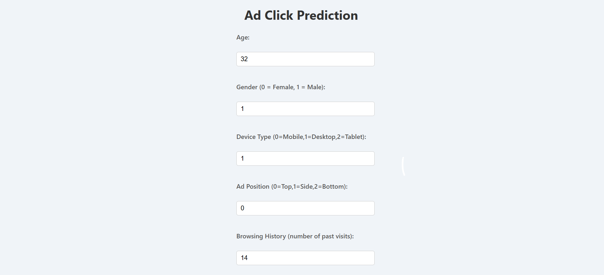

# 🖱️ Ad Click Prediction using Machine Learning

This project predicts whether a user will click on an advertisement based on features such as age, gender, device type, ad position, and more. It uses supervised machine learning models and a Flask-based web interface.

## 📊 Problem Statement

In online advertising, predicting whether a user will click an ad helps improve targeting and ROI. The goal of this project is to develop a binary classification model that can accurately predict ad click behavior.

---

## 🧠 Features Used

- `Age`
- `Gender`
- `Device Type`
- `Ad Position`
- `Browsing Time`
- `Income Group`
- `Region`
- `Clicked (Target)`

---

## 🚀 Technologies Used

### 🧪 Machine Learning

- K-Nearest Neighbors (KNN)
- GridSearchCV for Hyperparameter Tuning

### 💻 Web Development
- Python Flask
- HTML, CSS

### 📦 Others
- Pandas, NumPy, Scikit-learn, Matplotlib
- Pickle (for model serialization)

---

## 📁 Project Structure
ad-click-prediction/
│
├── static/
│   └── style.css             - CSS styling
│
├── templates/
│   └── index.html            - HTML frontend
│
├── models/
│   └── knn_model.pkl         - Trained KNN model
│
├── notebooks/
│   └── knn_model.ipynb       - Jupyter notebook for model development
│
├── app.py                    - Flask app script
├── ad_click_dataset.csv               - Dataset
├── screenshot1.png           - Web UI screenshot
├── screenshot2.png           - Prediction screenshot
└── README.md                 - Project documentation

---

## 🧪 How to Run

### 1. Clone the Repository

    git clone https://github.com/suhanakesharwani/ad-click-prediction.git
    cd ad-click-prediction

### 2. Install Dependencies 

    pip install -r requirements.txt

### 3. Run the App

    python app.py

### 4. Open in Browser

    Open your browser and go to http://127.0.0.1:5000/

## 📷 Screenshot

---

## ✍️ Author

**Suhana Kesharwani**  

GitHub: [@suhanakesharwani](https://github.com/suhanakesharwani)  
LinkedIn: [Suhana Kesharwani](https://www.linkedin.com/in/suhana-kesharwani-b11044326)

